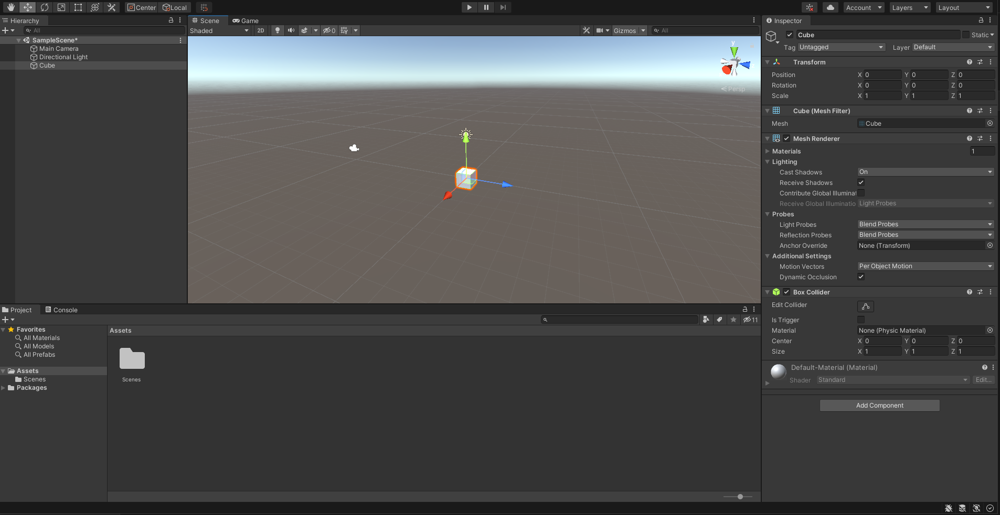
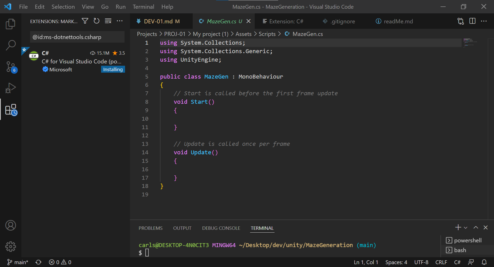
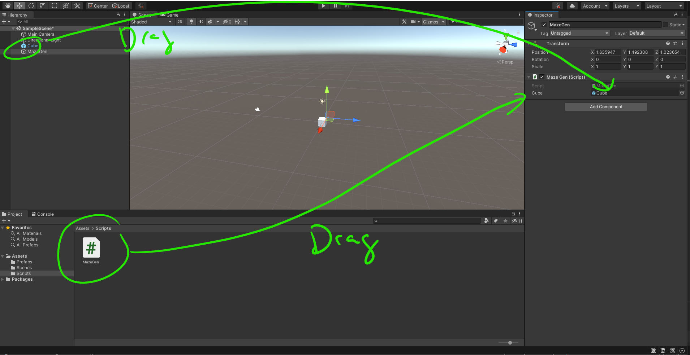
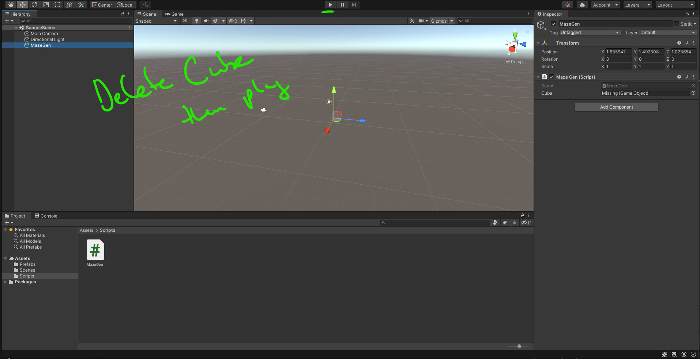
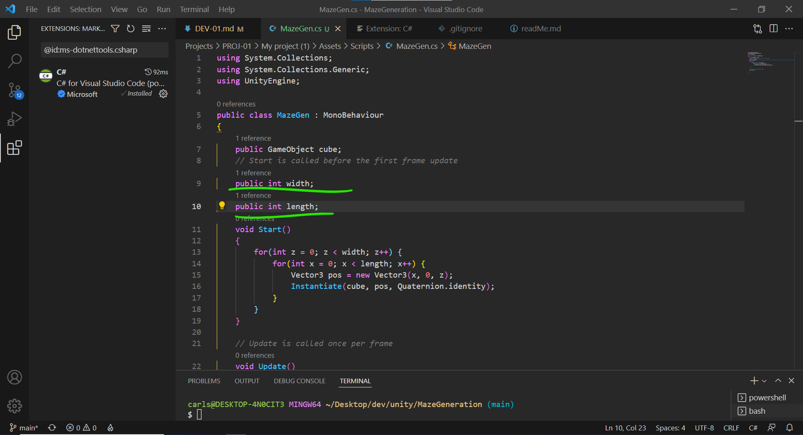

# DEV-01, Defining a Modular Maze
### Tags: [modular]
### Link:[<https://www.udemy.com/course/procedural-maze-dungeon-generation/learn/lecture/23291016#overview>]

## What is Modular?
    What that means is that every 'part' or 'unit part' of the maze has to be the same size.
    The mazes have to basically click together in sections that are all the same size and can be mathematically determined.

## Creating our Scene
    Create a 1x1x1 meters cube, this also makes it relatively easy to to work with math

