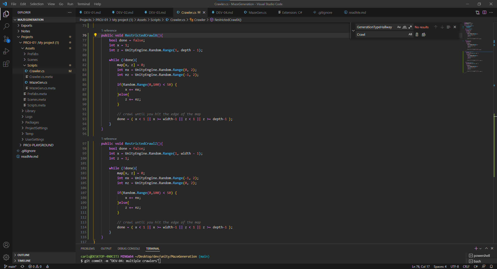
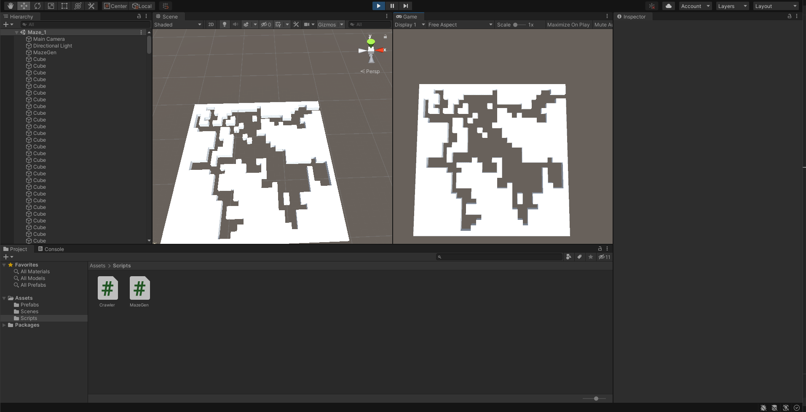
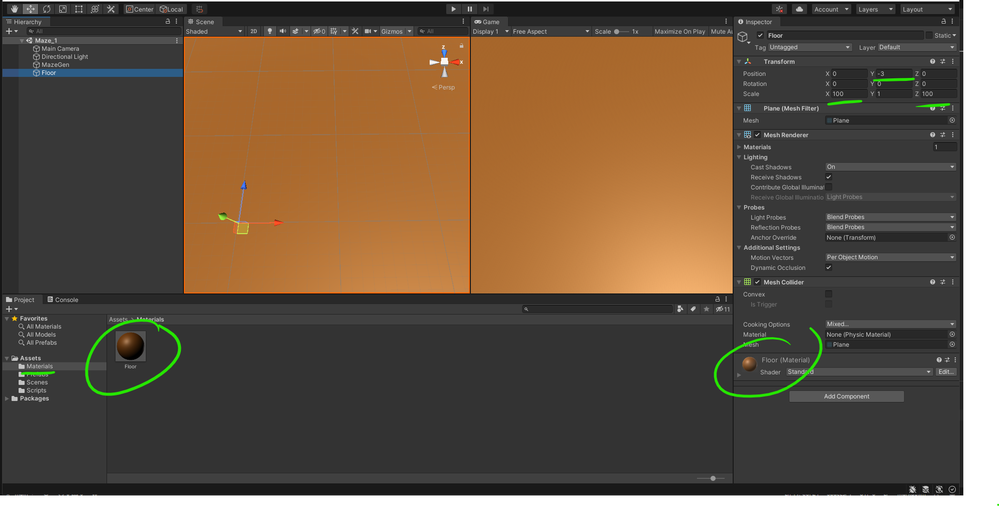
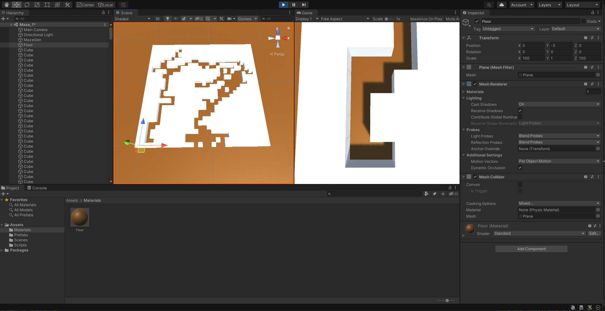

# DEV-05, Placing Borders, Scaling and Flooring
### Tags: [scripting, materials]
### Link:[<https://www.udemy.com/course/procedural-maze-dungeon-generation/learn/lecture/23291038#overview>]

## Borders

## Flooring

## Scaling

